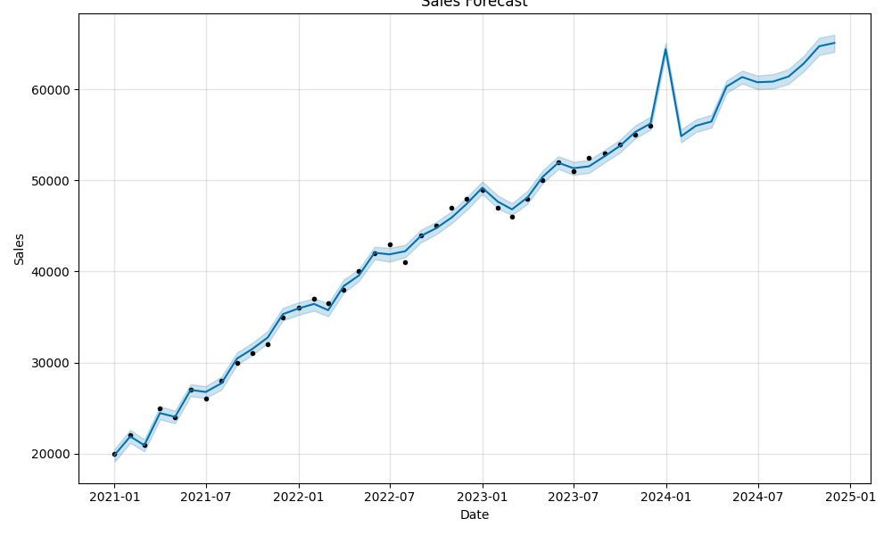

# FUTURE_ML_01

## 🚀 Task: Sales Forecasting for Retail Business

### 📦 Tools Used:
- Python
- Prophet
- Pandas, Matplotlib, Scikit-learn
- Google Colab

### 📈 Output:
- 12-month sales forecast
- Trend and seasonality visualizations

### 📊 Forecast Plot:

